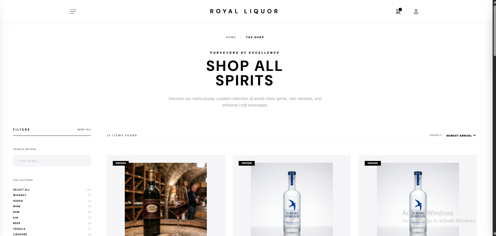
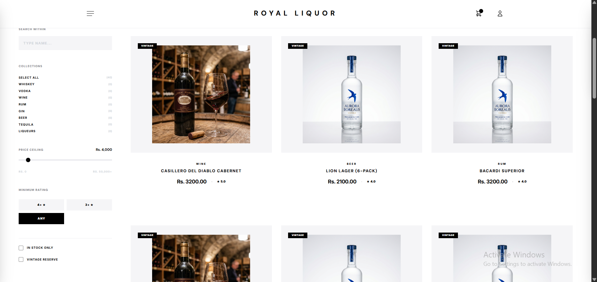
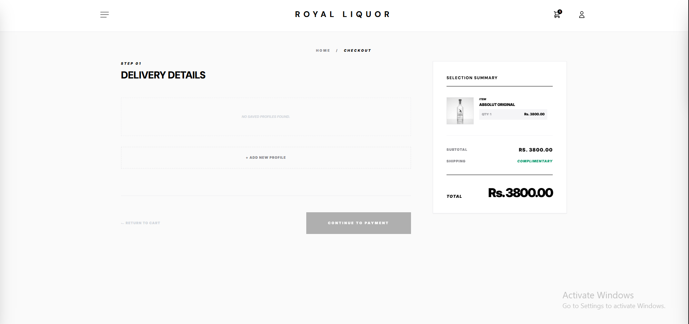

# Royal Liquor — E-Commerce Platform

An e-commerce platform built with Vanilla PHP 8.2 and JavaScript. No frameworks.
Custom MVC architecture, Reflection-based DI container, regex router, multi-warehouse stock engine.

For the full technical breakdown, see [ARCHITECTURE.md](ARCHITECTURE.md).

---

## Key Features

- **Custom-Built MVC Engine**: Modern PHP architecture implemented from scratch without external frameworks.
- **Automated Dependency Injection**: Reflection-based DI container for automatic class wiring.
- **Multi-Warehouse Stock Engine**: Robust FIFO inventory management with row-level locking.
- **Admin SPA Dashboard**: A high-performance, framework-less Single Page Application for management.
- **Advanced Security**: Integrated CSRF protection, session-based rate limiting, and SQL injection prevention.
- **PostgreSQL Optimized**: Using complex views and efficient indexing for high-performance data retrieval.

---

## Interface Preview

This section showcases the premium monochrome UI and key features of the platform.

### 1. Landing Page
The hero section focuses on elegance and high-end aesthetics.


### 2. Product Selection
A clean, structured grid for browsing our curated collection.


### 3. Product Details
Comprehensive view of individual products including tasting notes and reviews.


### 4. UI Components
Additional views of the modernized interface elements.


---

## Quick Start

### Requirements
- [Docker Desktop](https://www.docker.com/products/docker-desktop/)

### 1. Start the environment
```bash
docker-compose up -d
```
This creates the PostgreSQL database, loads the schema (`database/schema.sql`), and populates seed data (`seed_data.sql`).

### 2. Build assets
```bash
npm install
npm run build:css
```

### 3. Access
- **Storefront**: http://localhost
- **Admin**: http://localhost/admin/index.php
  - Email: `admin@royal-liquor.com`
  - Password: `Admin123!`

---

## Development

### CSS
Tailwind v3.4. No manual CSS files.
- Watch: `npm run dev:css`
- Build: `npm run build:css`

### Backend
Custom PSR-4 autoloader. Classes added to `src/` are loaded automatically via `src/Core/bootstrap.php`.

---

## Security
- **CSRF**: Token validated on all POST/PUT/DELETE requests.
- **Rate Limiting**: Per-session sliding window on sensitive endpoints.
- **Strict Types**: Enforced in all `src/` files.
- **Passwords**: BCrypt via `password_hash()`.
- **SQL**: Prepared statements everywhere.
